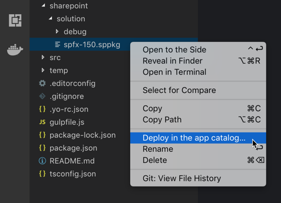
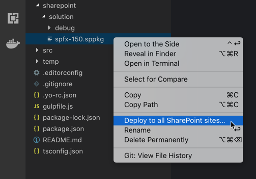
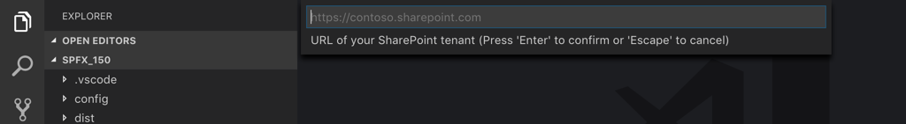
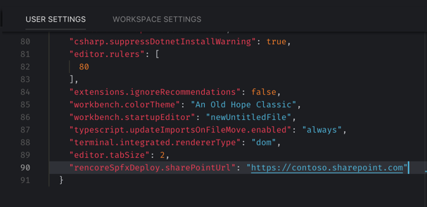
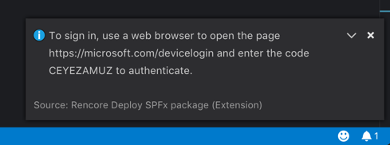
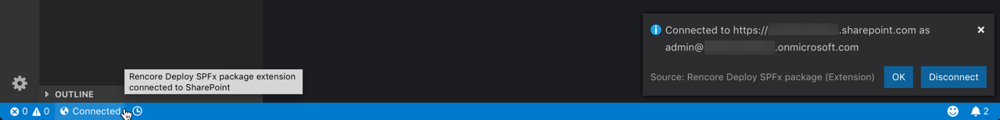

# Rencore Deploy SPFx Package

Easily deploy a SharePoint Framework solution package to SharePoint Online directly from Visual Studio Code.

## Deploy the solution

Choose if you want to deploy the solution in the app catalog or to all sites in your tenant.

_The extension will automatically upload the selected package to the tenant app catalog. If the package already exists, it will be overwritten. Only solutions that support global deployment, can be deployed globally._

## Connect to your tenant

Connect to your SharePoint Online tenant, by specifying its URL.

_You can specify the URL permanently using the `rencoreSpfxDeploy.sharePointUrl` setting. When this setting is specified, you won't be prompted for the SharePoint URL._

## Keep your credentials to yourself

When connecting to your tenant, the extension uses OAuth and doesn't have access to your credentials. It can only access your tenant after you granted it permissions and signed in with your account.

_At any time you can revoke the extension's permissions through Azure AD applications settings._

## Check connection status

At any time, check the status of your connection to SharePoint.

## Release Notes

### 1.0.1

Added handling error when app catalog can't be found

### 1.0.0

Initial release